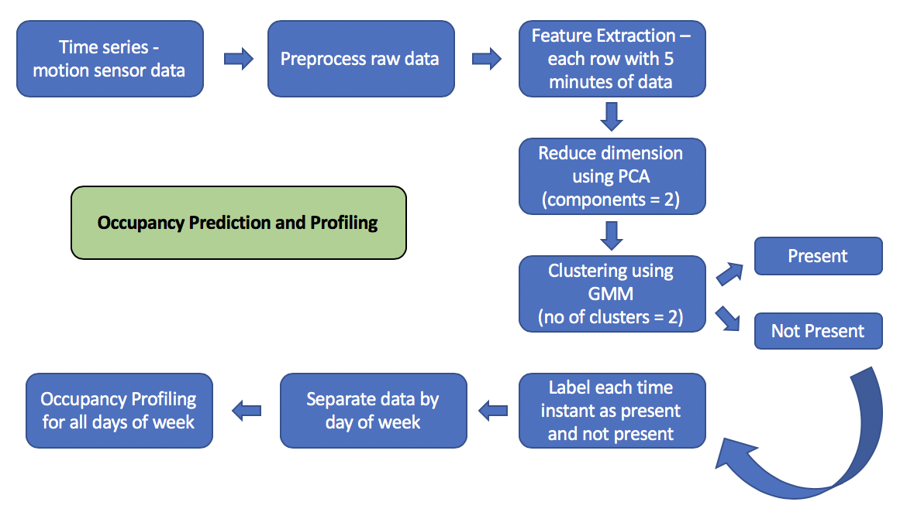
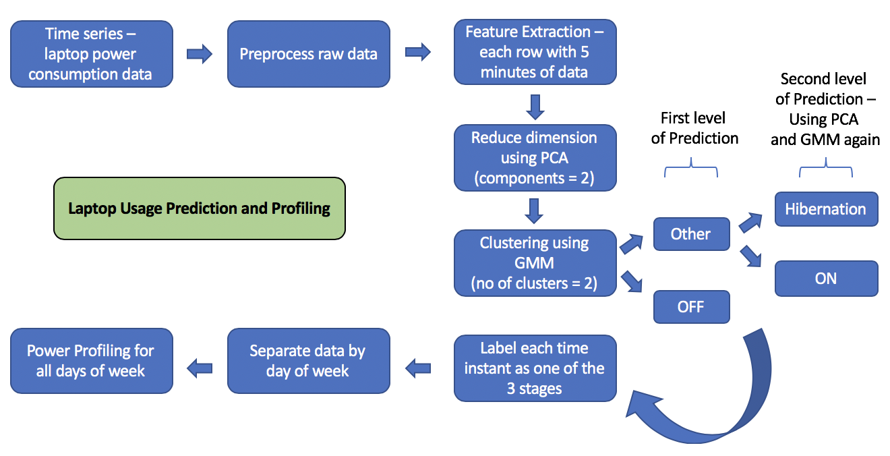

## Life Of A Desk - Smarter Environments with ARUP

By Abinaya Manimaran and Ashrant Aryal at Innovation in Integrated Informatics LAB - iLab, University of Southern California

# Occupancy Prediction and Profiling
- Predicts the occupancy of the person in the desk based on motion sensor data
	- person present in the desk
	- person not present in the desk
- Profiling of occupancy - output is the probability of the person being present at a desk:
	- For all weekdays and weekends separately
	- Probability of occupancy at different time of day

# Laptop Usage Prediction and Profiling
- Predicts the laptop usage by a person based on power consumption data 
	- laptop switched OFF
	- laptop in hibernation/standby mode
	- laptop switched ON 
- Profiling of power - output is the probability of laptop usage by the person for three different modes
	- For all weekdays and weekends separately
	- Probability of laptop usage at different time of days
	

